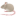
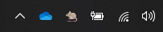

  <div align="center">
    <h1>Wake Up!</h1>
    <a href="https://github.com/pnbarbeito/wake_up/blob/main//README.es.md"></a>
    <a href="https://github.com/pnbarbeito/wake_up/blob/main//README.md"></a>
    <p>
       Wake Up! is a desktop application that prevents your PC from locking. It moves the mouse pointer at regular intervals to prevent screen lock and state changes due to inactivity in apps like MS Teams. It does not require installation and once started, it resides in the system tray.
    </p>

  

  </div> 

  <div align="center">

  <h2>Download</h2>

  You can download the application from the [releases](https://github.com/pnbarbeito/wake_up/releases) section of this repository.

  </div>

  <div align="center"><h2>Application Details</h2></div>

  This application combines the native Windows library with [Robotgo](https://github.com/go-vgo/robotgo) to move the mouse pointer and prevent PC lock. The application was designed for corporate environments where the user cannot change the power settings of the PC. Both libraries were used to move the pointer due to a bug in [Robotgo](https://github.com/go-vgo/robotgo) where it does not correctly move the pointer on systems with multiple screens. The native library alone was not used as it does not prevent screen lock. 
  To place the app in the system tray, [systray](https://github.com/getlantern/systray) was used. [2goarray](https://github.com/cratonica/2goarray) was used to encode the icon into a Go byte slice, and [go-winres](https://github.com/tc-hib/go-winres) was used for the executable icon.

  <div align="center"><h2>Compilation Instructions</h2></div>

  <details>
  <summary></summary>

  ### Prerequisites

  To compile the application, you will need to have Go installed on your operating system. If you haven't installed Go yet, you can download it from the [official Go website](https://golang.org/). Additionally, we will be using [go-winres](https://github.com/tc-hib/go-winres), so we need to install it.

    ```shell
    go install github.com/tc-hib/go-winres@latest
    go-winres make
    ```

  ### Customization

  In the ./winres directory, you will find the app's icon configuration file and the required images. If you want to change the application's icon, replace them with your own while maintaining the sizes. Then, before compiling the application, you need to execute

    ```shell
    go-winres make
    ```

  To change the taskbar icon, go to the ./icon folder and replace iconwin.ico with the desired icon. Then drag and drop it onto make_icon.bat. 
  The script was obtained from the example in [systray](https://github.com/getlantern/systray).

  ### Compilation

    ```shell
    go build -ldflags -H=windowsgui -o executable_name.exe
    ```
  </details>

  <div align="center"><h2>Acknowledgements</h2></div>

  We would like to thank the following projects for their contribution to this application:

  - [Robotgo](https://github.com/go-vgo/robotgo): A library that allows interaction with the graphical user interface on Windows, macOS, and Linux systems. We use Robotgo to move the mouse pointer and prevent PC lock.

  - [systray](https://github.com/getlantern/systray): A library that facilitates the creation of applications with a system tray on Windows, macOS, and Linux. We use systray to place the application in the system tray.

  - [2goarray](https://github.com/cratonica/2goarray): A tool that converts PNG image files into a Go byte slice. We use 2goarray to encode the application's icon into a byte slice.

  - [go-winres](https://github.com/tc-hib/go-winres): A tool that allows adding resources to Windows executables, such as icons and metadata. We use go-winres to add the icon to the application's executable.
